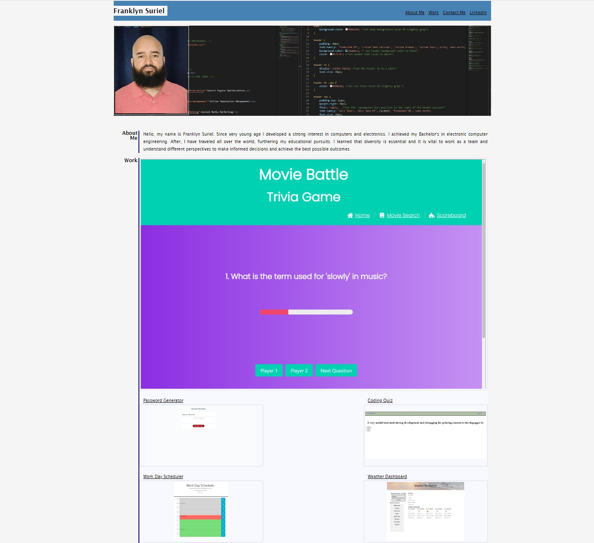

# Portfolio

## Description

Portfolio webpage with the picture, works, contact and description of myself. 

## Link

https://franklynsuriel.github.io/Portfolio/

## Usage

To use this portfolio, you can open it in a browser. You can click on the navigation bar to go to the different sections and a linkedin profile. The about me section will describe me and the work section will showcase my latest project. The contact me section will show my phone number my github repositories and my email

The following image shows the web application's appearance and functionality:

## License

MIT
